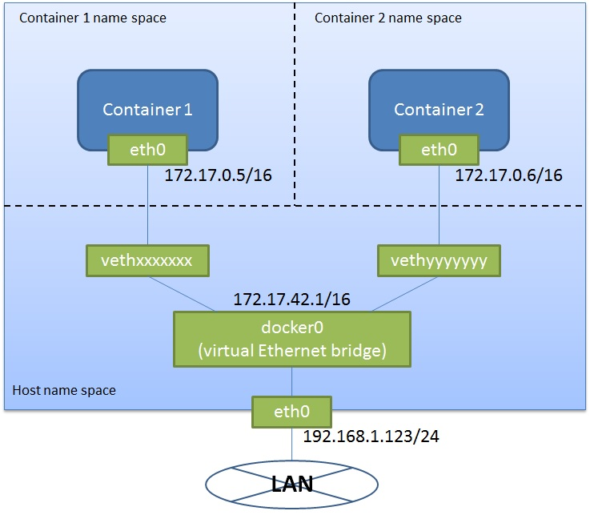

# Docker Networking

## Default Docker Network Model:



在 Docker 與 Host 之間成為 ``docker0`` 的網路介面(bridge)，溝通 Host 主機與 Container 的橋樑

* 在 Host 主機上使用 **ifconfig** 將會看見 ``docker0`` 網路介面
* Mac OS 上面由於作業系統限制，無法看見

網路介面在 docker 中有四種類型：

* ``none`` network (網路隔絕)
* ``bridge`` network (透過docker中的虛擬介面來區隔區域網路)
* ``host`` network (將網路架在主機上，與主機共用 network stacks)
* ``overlay`` network (不同主機之間的溝通)

## 常用指令說明：

  ```sh
    docker network ls # 列出所有網路介面
    docker network inspect [interface_name] # 秀出指定介面的詳細資訊
    docker network create --driver [bridge/host/none]
    docker network connect [network_name] [container_name]
    docker run -d --net [interface] [container_image]
      # 將 container run 在指定的網路介面
      # 可以使用 --name [new_name] 指定 container name
  ```

## 網路介面說明：

* ``none`` network:
  1. 所有的 containers 都是網路獨立的(isolated)，對外界隔絕
  1. 稱為 **Close container**
  1. 只有 lo (loopback) 網路介面
  * 範例：
  ```sh
    docker run -d --net none redis
    # 將 redis 以 none network 的形式啟動
  ```
  * 應用場景：
    * 網路隔絕，擁有最佳保護
    * 如果 container 需要 http request 則不適用此場景
    * 對於 network security 要求比較高的場景

* ``bridge`` network:
  * default type of all containers
  * 透過建立不同的 bridge network 可以自訂區域網路, 可以與外界溝通
  * 擁有兩個網路介面： lo (loopback) 以及 private (bridge network to the host)
  * 相同的 bridge 可以彼此溝通，不同的 bridge network 不能彼此溝通(除非透過 docker network connect 將容器連接)
  * 範例：

    ```sh
      docker run -d --name container_1 busybox
        # 當你 run 一個容器而不指定網路介面，預設連線到 「bridge」(driver 與 name 同名)
        # 也就是說以前所有 run 的 container 在不指定 network 情形下都可以互相連通
      docker network create --driver bridge my_bridge_net # 創造一個新的網路介面
      docker run -d --name container_2 --net my_bridge_net redis
        # 透過 network create 一個全新的 bridge, 稱為 my_bridge_net
        # 透過 run 一個全新的容器並指定連接到 my_bridge_net 網路介面
        # 可透過 docker network ls 以及 docker network inspect 檢查各種介面的詳細資訊
      docker network connect my_bridge_net container_3 # 將 container_3 連接到指定的介面：my_bridge_net
    ```

  * 應用場景：
    * suitable where you want to set up a relatively small network on a single host

* ``host`` network:
  * network 防護最低，把 container 的網路介面架在 host 上面，能存取 host 的其他介面
  * 又稱為 **open containers**
  * 優點： Performance 最快（因為無須 ip table 轉換）
  * 缺點：非常危險，不適用於 production

* ``overlay`` network:
  * 可以 deploy on cross, multiple network hosts
  * 使用 overlay network 前提：
    * Running Docker engine on **Swarm** mode
    * A key-value store such as consul
  * 應用場景：
    * 最常見於 production.
    * 詳細內容請參見 ``docker-swarm``.

## 使用 ``docker-compose`` 架構網路：

* 預設使用 ``docker-compose up -d`` 會在容器形成之前自行產生網路介面(bridge), 名字為 [current_dirname]\_default
* 在 **docker-compose.yml** 檔案中自定義網路介面：

    ```yml
      version: '2'
      services:
        wordpress:
          image: wordpress
          ports:
            - 8080:80
          environment:
            - WORDPRESS_DB_USER=test
            - WORDPRESS_DB_PASSWORD=test@wordpressDB
            - WORDPRESS_DB_NAME=wp-test # Will create if does not exist
            - WORDPRESS_TABLE_PREFIX=ts
          networks: # 連接自定介面
            - my_net
            - my_net_2
        mysql:
          image: mariadb
          environment:
            - MYSQL_ROOT_PASSWORD=root@wordpressDB
            - MYSQL_DATABASE=wp-test
            - MYSQL_USER=test
            - MYSQL_PASSWORD=test@wordpressDB
          networks: # 連接自定介面
            - my_net

      # 新增自定義網路介面設定
      networks:
        my_net:
          driver: bridge
        my_net_2:
          driver: bridge
    ```
